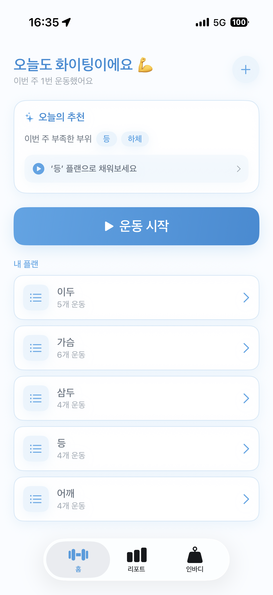
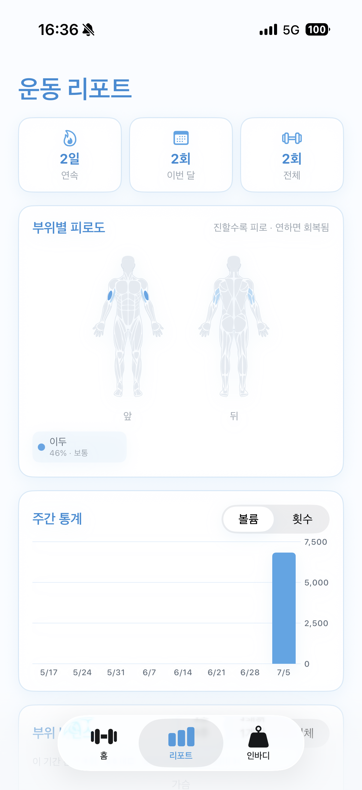
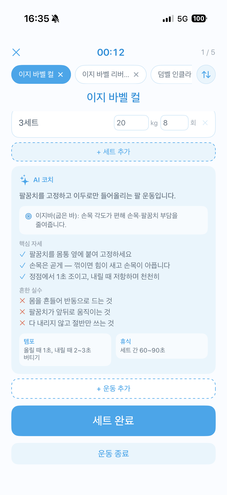
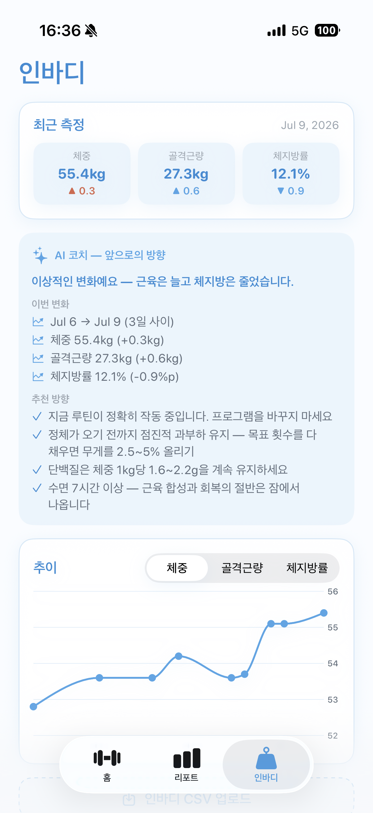
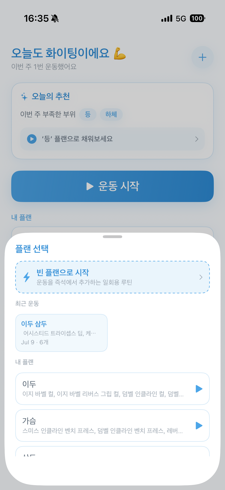
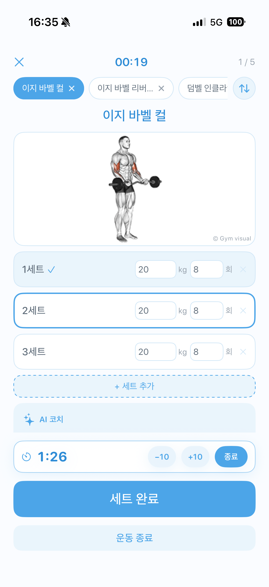
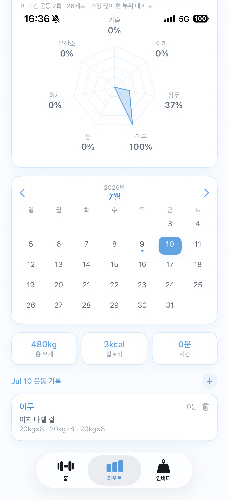
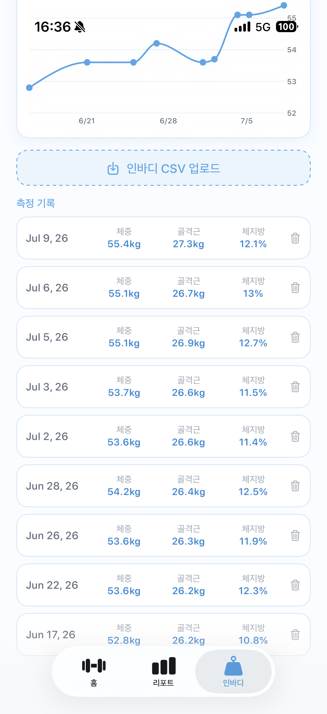

# 워카웃 (WorkoutApp)

| 홈 (오늘의 추천) | 부위별 피로도 | 세션 · AI 코치 | 인바디 분석 |
|:---:|:---:|:---:|:---:|
|  |  |  |  |

> ⚠️ **이 프로젝트는 개발 연습용입니다.**
> 개발자의 SwiftUI·iOS 개발 지식은 **낮은 수준**이며, 이 앱은 학습과 연습을 목적으로 제작했습니다.
> 따라서 코드 구조·설계·관례가 iOS 실무 표준과 다를 수 있고, 완성도보다 **직접 만들어보며 배우는 것**에 무게를 둔 프로젝트입니다.

## 1. 시스템 개요

운동 계획·기록·회복 관리를 하나로 묶은 SwiftUI iOS 애플리케이션입니다. 1,081개의 운동 카탈로그(자세 GIF 포함)로 루틴을 짜고, 세션 중 세트·휴식·AI 자세 코치의 도움을 받으며, 운동 기록을 근육별 회복 모델로 환산해 "지금 어느 부위가 얼마나 지쳤는지"를 인체 그림과 리포트로 보여줍니다. 인바디(체성분) CSV를 불러와 변화를 분석하고, 홈/잠금화면 위젯과 다이나믹 아일랜드로 회복 상태를 앱 밖에서도 확인할 수 있습니다. 흰색+연한 파란색 테마, 전 화면 한국어입니다.

**데이터 흐름**

```
[운동 카탈로그 exercises.json] → [플랜 편집] → [세션 진행] → [WorkoutRecord]
                                                                    ↓
                              [DataStore] → App Group 컨테이너(records.json) 저장
                                                    ↓                      ↓
                        [MuscleMap: 운동→자극 부위]        [WidgetKit reload]
                                                    ↓                      ↓
                        [Fatigue: 세부부위 회복 곡선]   [홈/잠금 위젯 · 다이나믹 아일랜드]
                                                    ↓
                        [BodyFatigueView 인체 그림 · 리포트 · 결과창]
```

세션에서 완료한 세트가 `WorkoutRecord`로 저장되면 `DataStore`가 이를 **App Group 공유 컨테이너**에 기록하고 위젯 타임라인을 갱신합니다. 저장된 기록은 `MuscleMap`이 운동별 자극 부위(주동근+협응근)로 분해하고, `Fatigue`가 근육별 지수 회복 곡선으로 감쇠·합산해 세부부위 단위 피로도로 환산합니다. 이 피로도는 앱(인체 그림·리포트)과 위젯이 동일하게 소비합니다.

---

## 2. 데이터 모델 & 저장소 (`Models.swift`, `DataStore.swift`)

### 주요 변수

| 변수 | 설명 |
|---|---|
| `DataStore.exercises` | 앱 번들의 `exercises.json`에서 로드한 운동 카탈로그 1,081개 |
| `DataStore.plans` / `records` | 사용자 플랜·운동 기록. `didSet`에서 App Group에 저장, records는 위젯도 갱신 |
| `DataStore.inbody` | 인바디 측정 기록 목록 (`inbody.json`) |
| `DataStore.favorites` | 즐겨찾기한 운동 id 집합 (`favorites.json`) |
| `PlannedSet` | 세트 단위. 웨이트는 `weight`/`reps`, 유산소는 `duration`(초)/`distance`(km) 옵셔널 |
| `WorkoutRecord` | 한 세션 기록. `duration`·`totalVolume`·`calories`를 계산 프로퍼티로 제공 |

### 주요 함수

- **`BodyPart.of(exercise)`** — 운동의 `primaryMuscles`(free-db 근육 어휘)를 6개 부위+유산소로 매핑
- **`BodyPart.subRegion(of:)`** — 이름 키워드로 세부부위 자동 분류(어깨/가슴/등/하체만)
- **`PlannedSet.defaults(for:)`** — 부위별 기본 세트 구성(유산소는 시간·거리 1회차, 그 외 3세트)
- **`DataStore.recentExerciseIDs(days:)`** — 최근 N일 내 수행한 운동 id를 최신순으로 반환(즐겨찾기·최근 소스용)
- **`DataStore.mergeInBody(_:)`** — 인바디 병합. 이미 있는 날짜(중복)는 제외하고 새 날짜만 추가
- **`SharedStore.loadRecords()`** — 위젯이 App Group 컨테이너에서 기록을 직접 읽는 진입점

### 저장 구조 (App Group)

앱과 위젯은 별개 프로세스라 UserDefaults·Documents로는 데이터를 공유할 수 없습니다. `SharedStore.appGroup`(`group.com.oddong.WorkoutApp`) 컨테이너에 JSON을 저장해 두 타겟이 같은 파일을 읽습니다. App Group 이전에 Documents에 저장된 레거시 데이터는 첫 로드 시 자동으로 공유 컨테이너로 이관됩니다.

---

## 3. 운동 카탈로그 & 선택 (`ExercisePickerView.swift`)

### 주요 변수

| 변수 | 설명 |
|---|---|
| `source` | 목록 소스 — 기본 / 최근 운동(2주) / 즐겨찾기 (`ExerciseSource`) |
| `part` / `sub` / `equip` | 부위 / 세부부위 / 기구 3단계 필터 |
| `selected` | 선택(추가 예정)된 운동 id 집합 |
| `query` | 검색어. 한글 음차명·영문명 양쪽으로 매칭 |

### 주요 함수

- **`filteredBase()`** — 부위·세부부위·기구 필터를 적용한 기본 풀 산출(유산소는 기구 필터 무시)
- **`items`** — 소스(기본/최근/즐겨찾기) × 필터 × 검색어를 모두 반영한 최종 목록. 최근 소스는 수행 순서로 정렬
- **`ExerciseThumb`** — 목록 행 앞 46pt 썸네일. GIF 첫 프레임을 `AsyncImage`로 정지 표시
- **`ExerciseMedia.provider.gifURL(for:)`** — 미디어 소스 추상화 진입점. 소스 교체 시 이 한 줄만 변경
- **`GIFView`** — `CGAnimateImageDataWithBlock`(ImageIO)로 잔상 없이 GIF 재생하는 `UIViewRepresentable`

### 이미지 추상화

`ExerciseImageProvider` 프로토콜 → `HasanGIFProvider`(GitHub raw GIF) 구현을 `ExerciseMedia.provider` 한 지점에서 주입합니다. 데이터셋이나 이미지 소스를 바꿔도 뷰 코드는 손대지 않습니다.

---

## 4. 운동 세션 (`WorkoutSessionView.swift`)

### 주요 변수

| 변수 | 설명 |
|---|---|
| `plan` | `@State`로 받은 플랜의 **복사본**. 세션 중 순서변경·운동추가·삭제가 원본 플랜엔 반영되지 않음 |
| `done` | 운동별 완료 세트 수 배열. `plan.exercises`와 인덱스가 병렬 |
| `restRemaining` | 휴식 남은 초(nil=휴식 아님). 세트 완료 시 기본 90초로 시작 |
| `exIndex` | 현재 진행 중인 운동 인덱스 |

### 주요 함수

- **`mainButton`** — 상태 기반 단일 버튼: 미완료 세트 있으면 "세트 완료"→휴식 시작, 전부 끝나면 "운동 종료", 아니면 "다음 운동"
- **`moveExercises(from:to:)`** — 세션 중 순서 변경. `plan`·`done`을 함께 재정렬하고 진행 중이던 운동 위치를 유지
- **`finishEarly()`** — 남은 세트가 있어도 종료. 완료한 세트·운동만 골라 기록에 저장
- **`WorkoutResultView.partSets`** — 결과창 근육 피로도 바. `MuscleMap`으로 협응근까지 환산한 세트 수로 표시

### Live Activity

세션 시작 시 `WorkoutActivityController.start()`가 다이나믹 아일랜드/잠금화면 Live Activity를 띄우고, 세트·운동이 진행될 때마다 `update()`로 진행률을 갱신합니다. 종료 시 `end()`로 정리합니다.

---

## 5. 근 피로도 & 자극 매핑 엔진 (`Models.swift`: `MuscleMap`, `Fatigue`)

이 앱의 핵심 로직입니다. "가슴 운동을 하면 삼두·전면어깨도 자극받는다"처럼 하나의 운동이 여러 부위에 주는 자극을 가중치로 분해하고, 근육별 회복 속도로 감쇠시켜 현재 피로도를 계산합니다.

### 주요 변수

| 변수 | 설명 |
|---|---|
| `MuscleRegion(part, sub)` | 부위+세부부위 조합 키. `sub == nil`이면 부위 전체 집계 |
| `Fatigue.fullRecoveryHours(part)` | 부위별 거의 완전회복(≈95%)까지 시간. 하체·등 72h / 가슴·어깨 48h / 이두·삼두 40h / 유산소 24h |

### 주요 함수

- **`MuscleMap.stimuli(for:)`** — 운동 → 자극 부위 목록. 주동근 1.0 + 협응근 0.2~0.6. 예: 벤치프레스 = 가슴·중부 1.0 / 삼두 0.5 / 어깨·전면 0.3, 인클라인 프레스 = 가슴·상부 1.0 / 어깨·전면 0.5 / 삼두 0.5
- **`Fatigue.decayK(part)`** — 시간당 감쇠상수. `exp(-k·T)=0.05` 이 되는 지점을 완전회복 시간으로 잡음(`k = ln(20)/T`)
- **`Fatigue.regionLevels(records:)`** — 세부부위 단위 피로도 dict 반환. 각 세션의 잔여 자극을 회복 곡선으로 감쇠·합산하고, 세부 항목은 부위 집계에도 함께 누적
- **`Fatigue.levels(records:)`** — 부위별 피로도 0~1. 협응근 포함이라 벤치만 해도 삼두·전면어깨 피로가 쌓임
- **`AICoach.hit(words, keys)`** — 자극 매핑·조언 공용 단어 매칭. 데이터셋 id가 숫자라 id+한글 음차명에서 단어를 뽑아 영문 키워드와 대조

### 모델 근거 (문헌 검토)

회복 시간 상수는 저항운동 후 근단백질 합성(MPS) 시간 경과와 ACSM/NSCA의 부위별 재훈련 간격(대근육 48~72h, 소근육 24~48h) 권고에 맞췄습니다. 자극량은 세트 수 기반으로, MEV(주 4~8세트)·MAV(주 10~20세트) 볼륨 연구와 정합하며 세션당 ≈10세트를 1회 최대 자극으로 포화시킵니다.

---

## 6. 부위별 피로도 시각화 (`BodyFatigueView.swift`)

### 주요 변수

| 변수 | 설명 |
|---|---|
| `levels` | `Fatigue.regionLevels()` 결과. 세부부위별 피로도 |
| `BodyPaths.front` / `back` | 부위+세부부위 태그가 붙은 인체 근육 벡터 패스 목록 |

### 주요 함수

- **`BodyFatigueView.heat(level)`** — 피로도 → 색 히트 램프(연하늘→블루→진남색). 투명도만 조절하면 44%와 100%가 비슷해 보여, 색상 자체를 보간해 단계 차이를 또렷하게 표현
- **`BodyPaths.parse(_:)`** — 절대좌표 M/L/C/Z 전용 미니 SVG 파서. 런타임에 벡터 패스를 `Path`로 변환
- **`figure(shapes:outline:)`** — `Canvas`로 부위 조각을 피로도 색으로 채우고 전신 윤곽선을 덧그림

### 벡터 데이터

인체 근육맵은 **react-native-body-highlighter**(MIT)의 남성 전/후면 SVG 패스를 절대좌표 큐빅(M/L/C/Z)으로 오프라인 변환해 파일에 내장했습니다(viewBox 724×1448). 이미지 에셋 없이 벡터로 그려 어떤 크기에서도 선명하며, 등(승모/광배/하부)·하체(대퇴/햄스트링/둔근/종아리)는 조각별로 다른 피로도 색이 칠해집니다. 앱과 위젯이 공유합니다.

---

## 7. 리포트 (`StatsView.swift`, `RadarChart.swift`)

### 구성 요소

| 카드 | 설명 |
|---|---|
| 스트릭 | 연속 운동일 / 이번 달 / 전체 횟수 |
| 부위별 피로도 | 인체 그림 + 상위 세부부위 칩(수치·라벨) |
| 주간 통계 | Swift Charts 막대 그래프. 볼륨/횟수 토글, 최근 8주 |
| 부위 밸런스 | 레이더 차트. 기간 토글(1주/1개월/전체), 최다 부위 대비 % |
| 달력 · 일별 상세 | 기록 있는 날 표시, 선택 날짜에 수동 기록 추가(+ 버튼) |

### 주요 함수

- **`currentStreak()`** — 오늘(안 했으면 어제)부터 거슬러 연속 운동일 계산
- **`balanceData()`** — 기간 내 부위별 세트 수를 최다 부위 대비 비율로 정규화. 미래 날짜 기록은 제외
- **`RadarChart`** — 다각형 데이터 경로를 그리는 커스텀 레이더 차트(0%는 중심으로 수렴)
- **`ManualRecordView`** — 선택 날짜에 운동을 골라 세트를 구성하고 `WorkoutRecord`로 저장하는 시트

---

## 8. 인바디 체성분 분석 (`InBodyView.swift`, `Models.swift`)

### 주요 함수

- **`InBodyRecord.parse(csv:)`** — 인바디 앱 CSV 파서. 헤더 키워드로 열을 자동 감지(열 순서 무관)하고, EUC-KR 인코딩 폴백, 압축 날짜(`20260709`)까지 지원. "목표체중" 같은 함정 열은 제외
- **`InBodyCoach.advice(records:)`** — 직전 측정 대비 **골격근량 × 체지방 4분면 판정**으로 방향 진단. 측정 오차(근육±0.3kg, 체지방률±0.5%p) 이하는 "유지"로 처리하고, 급격한 체중 변화(주 1% 초과)엔 경고를 덧붙임

### 4분면 진단

| 변화 | 판정 |
|---|---|
| 근육↑ 지방↓ | 이상적인 리컴프 — 현 루틴 유지 |
| 근육↑ 지방↑ | 증량(벌크) 흐름 — 잉여 칼로리 관리 |
| 근육↓ 지방↓ | 감량 중 근손실 — 속도↓·단백질↑ |
| 근육↓ 지방↑ | 최악 방향 — 근력운동·단백질·수면 재점검 6단계 처방 |

첫 측정은 기준점 안내, 체중 데이터만 있으면 제한적 조언으로 분기합니다.

---

## 9. AI 자세 코치 (`Models.swift`: `AICoach`, `KoName`)

### 주요 함수

- **`AICoach.advice(for:)`** — 운동별 전용 조언(웨이트 25+패턴, 유산소 8패턴+기본). 부위 기본 조언에 동작별 세부 항목을 덮어써 요약·핵심 자세·흔한 실수·템포·휴식을 반환
- **`variationNote(_:_:)`** — 변형 노트(최대 2개). 같은 동작의 그립·각도·기구 차이를 설명. 예: 해머컬=상완근·측면 두께 vs 일반 컬=이두 전체
- **`KoName.translate(_:)`** — 영문 운동명을 단어 음차 사전 + 하이픈/슬래시 분리 + 불용어 제거로 한글 통용명으로 변환

### 근거 보정

자세 조언은 문헌과 대조해 보정했습니다. 예를 들어 런지의 "무릎이 발끝을 넘지 않게"는 반박된 통설(Fry 2003·Schoenfeld 2010 — 무릎 제한 시 허리·고관절 부담 급증)이라 "무릎=발끝 방향 정렬"로 수정했습니다.

---

## 10. 위젯 & Live Activity (`WorkoutWidget/`)

### 구성

| 파일 | 역할 |
|---|---|
| `WorkoutWidgetBundle.swift` | 위젯 번들 `@main` 진입점, 위젯 공용 색 정의 |
| `FatigueWidget.swift` | 7일 피로도 위젯. 홈 소형/중형은 인체 그림(`BodyFatigueView`), 잠금 액세서리는 텍스트/게이지 |
| `WorkoutLiveActivity.swift` | 다이나믹 아일랜드 / 잠금화면 Live Activity |

### 주요 함수

- **`FatigueProvider.getTimeline()`** — 3시간마다 피로도를 다시 계산하는 타임라인 제공. 앱에서 기록이 바뀌면 `WidgetCenter.reloadAllTimelines()`로 즉시 갱신
- **`FatigueWidgetView`** — `widgetFamily`별 뷰 분기(소형/중형/가로형/원형). 홈 위젯은 흰색 배경 고정으로 다크모드 무시

`BodyFatigueView.swift`·`Models.swift`·`WorkoutActivityAttributes.swift`는 앱·위젯 두 타겟에 함께 포함되어(pbxproj membershipExceptions) 같은 로직·그림을 공유합니다.

---

## 11. 핵심 설계 포인트

- **세부부위 자극 매핑**: 운동을 부위 하나가 아니라 주동근+협응근 가중치로 분해(`MuscleMap`)해, 실제 근육 동원과 가깝게 피로도를 누적. 벤치프레스가 삼두·전면어깨 피로에도 반영됨
- **지수 회복 모델**: 근육 크기별 회복 시간 상수를 지수 감쇠로 모델링해, 운동 직후 최대 → 시간이 지날수록 자연스럽게 회복. 문헌(ACSM/NSCA·MPS·볼륨 연구)과 정합하도록 상수를 검토
- **앱↔위젯 로직 공유**: 피로도 계산(`Fatigue`)과 인체 그림(`BodyFatigueView`)을 두 타겟이 공유해, 리포트와 위젯이 항상 같은 결과를 보여줌
- **벡터 인체맵 내장**: 근육맵 SVG를 절대좌표 큐빅으로 오프라인 변환해 파일에 내장 — 외부 이미지·런타임 의존 없이 어떤 크기에서도 선명
- **미디어 소스 추상화**: `ExerciseImageProvider` 프로토콜 한 지점(`ExerciseMedia.provider`)에서 GIF 소스를 주입해, 데이터셋·라이선스 교체 시 뷰 수정 불필요
- **비파괴적 세션**: 세션은 플랜의 복사본으로 동작해, 진행 중 순서변경·운동추가가 원본 플랜을 오염시키지 않음

---

## 12. 앱 화면 모아보기

### 12.1 홈 / 세션

| 홈 (오늘의 추천) | 플랜 선택 | 세션 진행 (세트 기록) | AI 자세 코치 |
|:---:|:---:|:---:|:---:|
|  |  |  |  |
| 이번 주 부족한 부위를 분석한 추천 플랜 | 빈 플랜 또는 저장된 플랜으로 시작 | 세트별 무게·횟수 기록과 휴식 타이머 | 운동별 핵심 자세·흔한 실수·템포 안내 |

### 12.2 리포트

| 부위별 피로도 | 부위 밸런스 (레이더 차트) |
|:---:|:---:|
|  |  |
| 세부부위 회복 곡선을 인체 그림 위에 시각화 | 기간별 부위별 볼륨을 최다 부위 대비 비율로 비교 |

### 12.3 인바디 체성분 분석

| 측정 기록 (CSV 업로드) | AI 코치 조언 |
|:---:|:---:|
|  |  |
| 인바디 CSV로 불러온 날짜별 체중·골격근·체지방 | 골격근×체지방 4분면 판정 기반 방향 제안 |

---

## 기술 스택

SwiftUI · WidgetKit · ActivityKit(Live Activity) · Swift Charts · Canvas · ImageIO(GIF) — Xcode 16 / iOS 17.0+ 타겟

## 참고: 데이터·이미지 라이선스

- 운동 데이터셋: `hasaneyldrm/exercises-dataset`(ExerciseDB/GymVisual 계열)을 앱 스키마로 변환해 사용
- 자세 GIF: GymVisual 소유(비상업·출처표기 필수) — **상업 출시 전 다른 소스로 교체 필요**
- 인체 근육맵: react-native-body-highlighter(MIT) 벡터 패스를 변환해 내장

## 참고: 개발 배경

이 앱은 **개발 연습용**으로 제작한 프로젝트입니다. 개발자의 **SwiftUI·iOS 개발 지식은 낮은 수준**이며, 상용 출시가 아니라 SwiftUI와 앱 아키텍처를 직접 부딪혀 보며 학습하는 것이 목적이었습니다. 그 과정에서 위젯·Live Activity·데이터 저장·도메인 로직 설계 등을 실험적으로 구현했습니다. 코드의 관례나 완성도는 iOS 실무 표준과 차이가 있을 수 있습니다.

> 개인 학습·포트폴리오 목적으로 제작한 프로젝트입니다.
